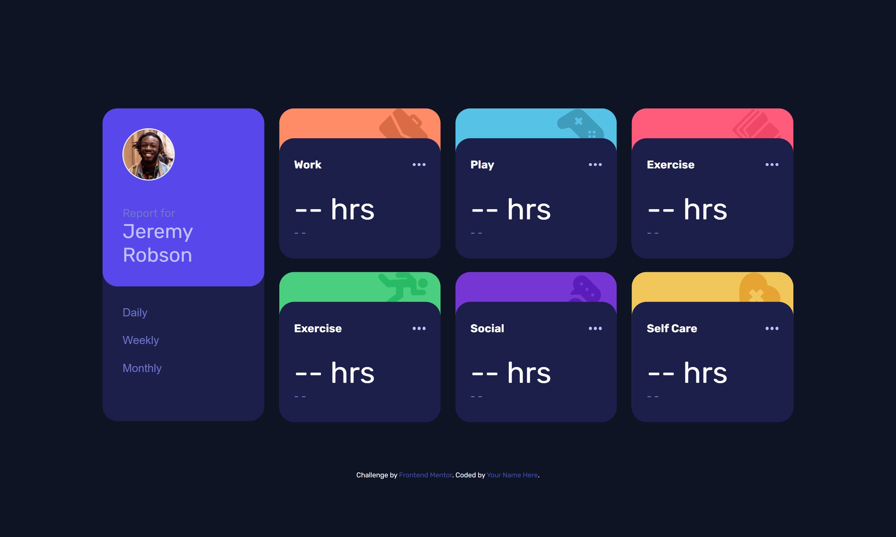

# Frontend Mentor - Time tracking dashboard solution

This is a solution to the [Time tracking dashboard challenge on Frontend Mentor](https://www.frontendmentor.io/challenges/time-tracking-dashboard-UIQ7167Jw). Frontend Mentor challenges help you improve your coding skills by building realistic projects.

## Table of contents

- [Overview](#overview)
  - [The challenge](#the-challenge)
  - [Screenshot](#screenshot)
  - [Links](#links)
- [My process](#my-process)
  - [Built with](#built-with)
  - [What I learned](#what-i-learned)
  - [Continued development](#continued-development)
  - [Useful resources](#useful-resources)
- [Author](#author)
- [Acknowledgments](#acknowledgments)

**Note: Delete this note and update the table of contents based on what sections you keep.**

## Overview

### The challenge

Users should be able to:

- View the optimal layout for the site depending on their device's screen size
- See hover states for all interactive elements on the page
- Switch between viewing Daily, Weekly, and Monthly stats

### Screenshot



### Links

- Solution [(https://your-solution-url.com)]
- Live Site [https://cheerful-bavarois-52c611.netlify.app/]

## My process

### Built with

- Semantic HTML5 markup
- CSS custom properties
- Flexbox
- CSS Grid
- Mobile-first workflow
- Vanilla JS

### What I learned

This was the challenging part I'm proud of the solution I made. All three timeframes used a similar layou. However I can't help to feel I could do better. surely there's a way that this code can be reduced to a function that takes in the timeframe and returns the necessary data. Hopefully I figure it out in the future!

```js
function updateDailyUI() {
  //timeframe - current
  //timeframe - last "(type)"
  //timeframe - previous (data)
  reportData.forEach((el, index) => {
    let current = el.timeframes.daily.current;
    let previous = el.timeframes.daily.previous;
    reportCards[index].querySelector(".set-current").textContent = current;
    reportCards[index].querySelector(".set-timeframe").textContent =
      "Yesterday";
    previous;
    reportCards[index].querySelector(".set-previous").textContent =
      previous + "hrs";
  });
}
```

### Continued development

I want to contine learning JS more in depth I feel like I've barely scarped the surface. Sure I know a little bit of this a little bit of that, but these projects seem to remind of the little I do know. Which all in all it's good because it means I'm learning something new!

### Useful resources

- [Resource 1](https://developer.mozilla.org/en-US/docs/Web/JavaScript/Reference/Global_Objects/Array/forEach) - This helped loop through each card and attach the correct data to it.
- [Resource 2](https://www.frontendmentor.io/learning-paths/javascript-fundamentals-oR7g6-mTZ-/steps/67c7794fa98e92cdab0b8cb3/article/read) - This section helped me for fetch -ing the necessary data.

## Author

- Website - still nothing sowwyyyy...
- Frontend Mentor - [@yourusername](https://www.frontendmentor.io/profile/moncadad)
